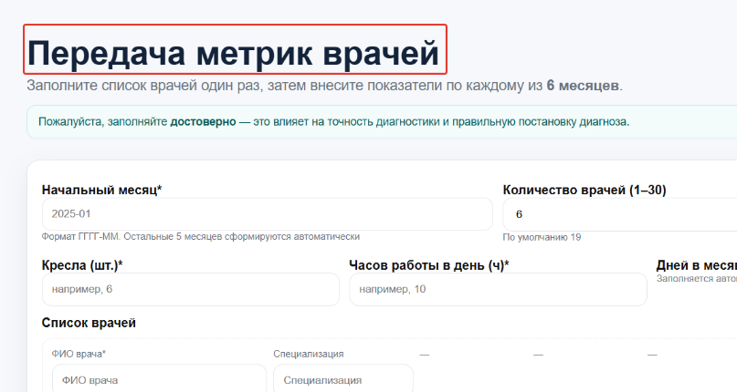
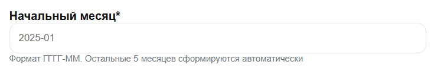
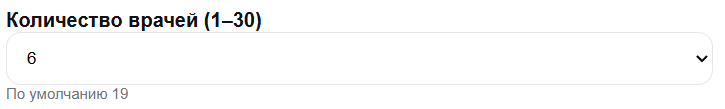
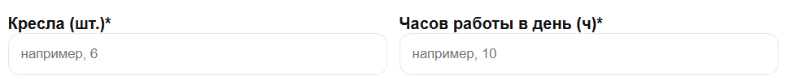
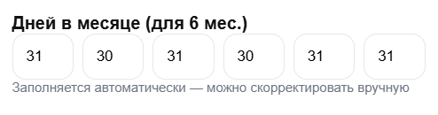
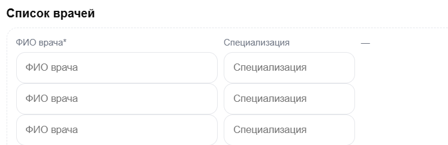
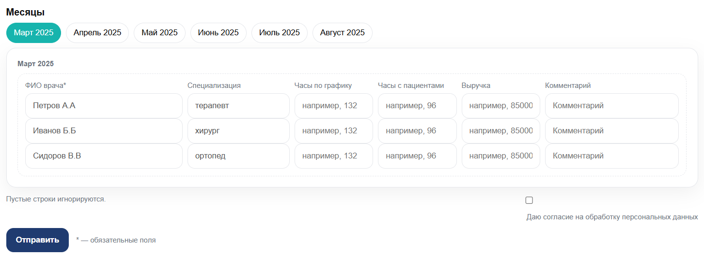

**Название**

заменить на «передача данных – Метрики эффективности стомклиники».

**Начальный месяц**

заменить окно ввода на выпадающий список, учесть, что отчет формируется за 6 месяцев до актуальной даты, то есть в сентябре (09) будет доступно выбрать только март (03), в октябре (10), только апрель (04). Даты в выпадающем в формате ГГГГ-ММ (2025-01, 2025-02, 2025-03 и т.д. до 2025-12), но активная для выбора только одна дата с учетом минус 6 месяцев, остальные даты серые (без возможности выбора).
Обязательно со * - что обязательно к заполнению.
эту подсказку о формате убрать. Оставить выпадающий список и подсказку «Остальные 5 месяцев сформируются автоматически»

**Количество врачей**

Оставляем также выпадающим списком, обязательно со * - что обязательно к заполнению. 

**Кресла и часов работы в день**

Все оставляем также со *.

**Дней в месяце**

Они автоматически формируются при внесении Начального месяца (я ввела 2025-03) 31- март, 30 – апрель и т.д.
Обязательно со * - что обязательно к заполнению.
В подсказке прописать – «Заполняется автоматически – нужно скорректировать количество рабочих дней вручную».
Если один из месяцев не скорректирован – не даст отправить шаблон и подсветит красным, что не заполнено.

**Список врачей**

ФИО врача со * - обязательно к заполнению.
Специализации выпадающим списком:
 - Гигиенист  
 - Имплантолог  
 - Ортодонт  
 - Ортопед  
 - Пародонтолог  
 - Терапевт  
 - Хирург  

Добавить колонку «Трудоустройство» с выпадающим списком
 - Постоянное место работы   
 - Совместительство

**Месяцы**

Месяцы со * - обязательно к заполнению.
Тут подтянется ФИО врача из списка врачей и его специализация, пользователю нужно заполнить столбцы «Часы по графику», «Часы с пациентами», «Выручка» - в выручке очень важно, чтобы цифры были разделены в суммах (например 120000 – НЕТ, 120 000 – ДА).
Пустые строки игнорируются – оставляем.

**Галочка о согласии обработки перс. данных**  
Отправить.
Разъяснения * - обязательные поля.
Также важен переход между ячейками автоматом, выбрал месяц, тебя переносит на кол-во врачей, дальше кресла, часов работы в день, каждый кубик дней в месяце (они как отдельные единицы), список врачей: 1. ФИО, 2. Специализация, 3. Трудоустройство, часы по графику, часы с пациентами, выручка, комментарий.